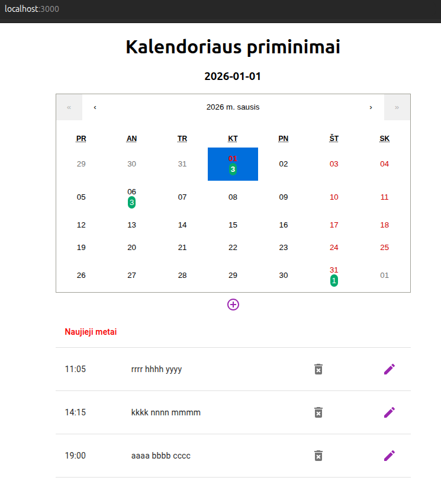

# Kalendoriaus priminimai

Kalendorius pateikia Lietuvos šventines dienas ir leidžia tvarkyti savo priminimus, 1 metų laikotarpiui nuo einamosios dienos.


Projektas skirtas tik demonstravimui.

## Aprašymas

Projekto dalys:
- `reminders_app` - kalendoriaus priminimų WEB aplikacija
- `reminders.api` - priminimų ir šventinių dienų REST
- priminimų saugykla `PostgreSQL` duomenų bazėje

`reminders_app` technologijos:
- `JavaScript`
- `React`
- `Material UI`
- `react-calendar`
- `x-date-pickers`
- `formik`
- `yup`

`reminders.api` technologijos:
- `Java`,
- `Spring Boot`
- `Spring JPA`
- `Flyway`

## Kaip pradėti?

### Priklausomybės

* Projektas sukurtas ir patikrintas tik Ubuntu 24.04.3 LTS aplinkoje
* `PostgreSQL` portas 5432
* `reminders.api` portas 8080
* `reminders_app` portas 3000
* šventinės dienos gaunamos iš https://date.nager.at/api/v3/PublicHolidays/2025/LT

### Instaliavimas

Projekto paleidimui reikalingos priemonės:
* `Docker Compose` versija nuo 1.29
* `Docker` versija nuo 27.3
* `Java 21`
* `npm` versija nuo 11.3
* `git` versija nuo 2.43
* 1GB disko vietos
* nenaudojami portai 5432, 8080, 3000
* internetas

### Paleidimas

* atsisiųsti `reminders.api` projektą iš `Github`
```
git clone

```
* atsisiųsti `reminders_app` projektą iš
```
git clone
```

* Startuoti `PostgreSQL`. Paleidimo skriptas `docker-compose.yaml` yra kataloge `reminders.api`, kuriame reikia įvykdyti skripto paleidimo komandą:
```
docker-compose up -d db
```

* Startuoti `reminders.api`. Kataloge `reminders.api` įvykdyti komandą:
```
./mvnw spring-boot:run
```

* Paleisti `reminders_app`. Kataloge `reminders_app` įvykdyti komandą:
```
npm run dev -- --port 3000
```

#### Saugyklos patikrinimas
* Patikrinti ar saugykla startavo. Komanda parodys `PostgreSQL` log, kuriame turi būti pranešimai, kad duomenų bazė pasirengusi darbui.
```
docker logs reminder_db
```
#### REST patikrinimas
* http://localhost:8080/swagger-ui.html - pateikia Swagger UI REST testavimui

#### WEB aplikacijos patikrinimas
* http://localhost:3000 - atidaro WEB aplikaciją


## Authors

* sprog256@gmail.com

## Version History

* 1.0 - 2025-11-11

## License

* nėra jokių licencijos appribojimų

